# Car Accident Prediction for Fleet Management for FussionSite

## I. Background and motivation:

FusionSite Services, a waste management company, operates a large fleet of over 800 specialized vehicles to ensure efficient waste collection and disposal. Fleet safety and timely operations are critical to maintaining regulatory compliance and avoiding reputational risks. Despite the company’s impressive growth rate of 120% per year, their previous telematics system failed to deliver the insights needed to improve safety, reduce costs, or streamline operations. With limited data, FusionSite faced higher risks and unnecessary expenses, impeding their ability to scale effectively. As their fleet grew, it became increasingly difficult to maintain uniform performance and consistency across regions, business units, and drivers.

In response, FusionSite implemented Motive’s AI-powered dual-facing Dashcams to enhance safety and support their growth. According to Ryan Ennis, Head of Risk and IT at FusionSite, the company has seen an 89% reduction in unsafe events within a year. Now, FusionSite is looking to leverage the data collected through these AI Dashcams to standardize safety and operations across newly acquired companies.

The project aims to address the critical issue of predicting and preventing vehicle accidents. By integrating data from driver behavior, state crash reports, and weather conditions, FusionSite plans to develop a predictive framework that identifies high-risk locations and times, enhancing fleet routing, driver safety, and overall service reliability.

The specific objective is to use binary classification to predict accidents based on driving patterns, driver behavior, crash data, and weather conditions.

## II. Data Overview

This project leverages multiple data sources to provide a comprehensive view of driving conditions, driver behavior, and environmental factors. Below is a concise summary of each dataset:

A. **Motive Data**

-   Purpose: Track driver behavior and vehicle conditions (hazard event types, driving periods, idle events, car inspections).
-   Usage: Correlate risky driving behaviors with crash events and generate internal risk metrics for drivers and vehicles.
-   Note: Data is not publicly available and is provided by FusionSite.

B. **Insurance Claims Data**

-   Description: Contains records of insurance claims including the date, time, location, and driver information for accidents involving FusionSites’ fleet.
-   Usage:
    -   Identify and confirm actual accidents among all recorded trips.
    -   Map claims back to Motive data to pinpoint which specific driving periods or events correspond to confirmed accidents.
-   Note: Data is not publicly available and is provided by FusionSite.

C. **State Crash Data (FMCSA’s MCMIS)**

-   Source: Federal Motor Carrier Safety Administration (FMCSA).
-   Description: Contains crash records (fatalities, injuries, vehicles involved) for trucks and buses reported by states.
-   Time Range: 2023–2025 (project scope).
-   Usage: Compute monthly, county-level crash statistics (e.g., number of crashes, fatalities, injuries). These aggregated statistics serve as ground truth for accident frequency trends.
-   Can be downloaded from the FMCSA website: [FMCSA MCMIS](https://ai.fmcsa.dot.gov/CrashStatistics/?tab=Summary&type=&report_id=1&crash_type_id=4&datasource_id=1&time_period_id=2&report_date=2025&vehicle_type=1&state=AllStates&domicile=US&measure_id=1&operation_id=null)
    -   We gathered this data from the {State Code} {Year} MCMIS sheets for every state of interest between the years 2023 and 2025, converted it to a csv and then saved all of the data for each year into its own csv. This process is outlined in more detail in `state_crash_data_raw_to_input.ipynb`. The outputs from this notebook were manually downloaded from the Google Cloud bucket, and directly uploaded into DBFS

D. **Precipitation Data (PRISM)**

-   Source: PRISM Climate Group at Oregon State University.
-   Description: Daily precipitation data for the continental United States.
-   Time Range: January 1, 2023 to January 31, 2025.
-   Spatial Resolution: 4km.
-   Usage: Incorporate weather context (especially precipitation) into accident risk modeling.
-   Can be downloaded from the PRISM website: [PRISM](https://prism.oregonstate.edu/). Data is "stable", or "provisional" depending on recency.
    -   The pre-processing for this dataset into the input data tables used in out data pipeline can be found in `weather_data_processing.ipynb`

F. **ZIP Code & Geographic Data**

-   Description:
    -   2020 Census 5-Digit ZIP Code Tabulation Area (ZCTA5) shapefiles.
    -   US Cities/States data (including state and county codes).
-   Source: U.S. Census Bureau TIGER/Line series, updated January 27, 2024.
-   Usage:
    -   Map accident records and precipitation data to ZIP codes and counties for location-based analyses.
    -   Provide geospatial referencing and consistent location naming across datasets.

See `Raw Data Dictionary.pdf` for more details on the data sources, including the specific columns used in the analysis.

## III. Tool & Infrastructure

### Core Technologies

-   Azure Databricks: Used for interactive analytics and distributed data processing on the Azure platform.

    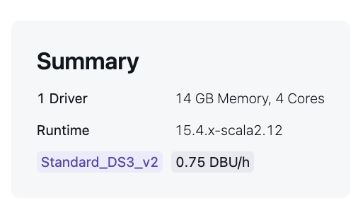

    -   We used the specifications above for training the GBT Classifier models and Multi Layer Perception without early stopping, but depending on your compute budget and timelines, you can adjust the cluster size and type.
    -   Specify build/install_geopandas.sh as the init script for the cluster
    -   The cluster is configured with the following libraries:
        -   `geopandas`: For geospatial data processing and analysis (PyPi)
        -   `contextily`: For retrieving and displaying tile map basemaps (PyPi)
        -   `optuna`: For hyperparameter tuning of machine learning models (PyPi)
        -   `com.crealytics.spark.excel`: For reading and writing Excel files in Spark (Maven coordinates: com.crealytics:spark-excel_2.12.0:0.14.0)

-   Google Cloud Dataproc: Provides a managed Hadoop and Spark cluster environment for large-scale data processing.

    -   The script used to create the cluster, `create_gc_bash.sh`, written by Yehyun Suh can be found in the `build` folder.
    -   Once this has been uploaded to the cloud shell editor run the following command to create the cluster:
        `bash create_gc_bash.sh -p_id <PROJECT_ID> -b_n <BUCKET_NAME> -c_n <CLUSTER_NAME> -region <REGION> -bill <BILLING_ACCOUNT>`

-   HDFS (Hadoop Distributed File System): Facilitates storage of large datasets in a distributed manner, enabling efficient parallel operations.

-   Spark: Employed for data parallelization, feature engineering, and large-scale model training.

### General WorkFlow:

1.  Data storage in HDFS
    After data cleaning and aggregation, we store both internal (FusionSites data) and external data in HDFS. While this increases storage needs, it prevents re-running heavy computations in subsequent steps.
2.  Feature engineering in a distributed environment
    We merge cleaned datasets in HDFS and use Spark on Databricks or Dataproc for parallel feature engineering. This approach handles large data volumes efficiently and shortens processing times.
3.  Model training with Spark
    We create train and test sets in HDFS and leverage Spark’s distributed ML libraries. Databricks or Dataproc resources scale on demand, keeping training both efficient and cost-effective.
4.  Python for final model execution
    Final model training and tuning run in Python scripts to reduce notebook overhead. This approach simplifies automation and keeps iterative experiments efficient. By saving intermediate outputs after each step, we avoid repetitive heavy-lift transformations, preserving data lineage and supporting iterative experimentation in a production-scale environment.

## IV. Repository Structure

### A. Motive EDA and Data Processing notebooks

> /data_processing/internal_motive_data

-   **motive_basic_eda.ipynb**
    -   Purpose: This notebook conduct very basic exploratory data analysis (like statistic summary, variables distributions) on Motive data on the raw data itself and doesn't do complex calculations to answer specific EDA questions. The goal is to understand the nature of the data and what kind of information can the data provide to use
    -   Outcome: Provides insights into table definitions, column descriptions, and initial data quality check
    -   
-   **motive_data_preprocessing.ipynb**
    -   Purpose: This notebook is used as our preliminary processing test to see how can we joined all the Motive tables (inspections, driving periods, combined events, idle events) into a unified data format.
-   **motive_eda_feature_selection.ipynb**
    -   Purpose: This notebook uses for slightly complex EDA questions and create Motive's data features engineer
    -   Outcome: 1 table that can be joined with external data with all the features engineer components created

#### B. External data processing notebooks

> /data_processing/external_data

Notebooks listed in the order they should be run.

-   **yearly_state_crash_data_processing.ipynb**

    -   Purpose: Preprocess and explore FMCSA state crash data.
    -   Aggregate individual crash events to monthly county-level crash counts, fatalities, injuries, and involved vehicles.
    -   Outcome: Crash statistics by state, county, month, and year.

-   **weather_data_processing.ipynb**

    -   Purpose: Preprocess spatially gridded daily precipitation data from PRISM
    -   Raw Features: Zip Code, Latitude, Longitude, Total precipitation (rain+melted snow) in mm
    -   Outcome: Precipitation data at the zip code level for each day

-   **site_radius_by_zipcode.ipynb**

    -   Purpose: This notebook is used to create a mapping of FusionSites sites to ZIP codes within a 40-mile radius. This is used to map the driver behavior data to the external data (weather and crash data) based on the site location.
    -   Outcome: A mapping of FusionSites sites to ZIP codes within a 40-mile radius.

-   **accident_data_location_processing.ipynb**

    -   Purpose: Refine accident records to extract and standardize relevant location information (mapping accident coordinates to counties or ZIP codes).
    -   Outcome: Ensures geographic accuracy, enabling robust spatial joins with other external data sources.

-   **map_external_location_data_to_accidents.ipynb**

    -   Purpose: Combine accident data with external datasets (PRISM precipitation, ZIP code shapefiles, state crash data, insurance claims) based on time and location.
    -   Outcome: Creates a single comprehensive dataset containing accident occurrences, driver behaviors, and environmental factors for each region.

-   **location_data_feature_engineering.ipynb**

    -   Purpose: Engineer features from crash and precipitation data to enable time series analysis and predictive modeling.
    -   Outcome: Processed and integrated crash and precipitation data, generating standardized features and key statistics to support predictive modeling, with results prepared for integration with the Motive API data

### C. Outcome Data

> /data_processing/outcome_data

-   **accidents_claims_data.ipynb**
    -   Purpose: This notebook is used to process the insurance claims data and combine it with the FusionSite accidents data. The goal is to create a unified dataset that includes both the insurance claims and the FusionSite accidents data.
    -   Outcome: A dataset that includes driver name, driver id and the date for all recorded accidents.

### D. Joined External and Internal Data

**data_aggregate_nb.ipynb**

-   Purpose: This notebook is used to combining external and internal data and further transform categorical type into One Hot Encoding. Afterward, we would split the data into train and test with threshold of 2024-11-01. Train data would be all the driver's trip before the threshold date. We are trying to predict after the threshold, which is our test data
-   Outcome: Train and Test data with columns that are ready for model training

### D. Model Training and Model Evaluation

**gbt_hypertraining.ipynb** , **rf_hypertuning.ipynb**, **mlp_hypertuning.ipynb**

-   Purpose: These notebooks train classification models using Gradient-Boosted Trees (GBT), Random Forest (RF), and a Multi Layer Perception Classifier. Training splits were stratified to ensure balanced representation of accident events in each fold. After identifying the best hyperparameters, the final model is evaluated on the held-out test set.
-   Outcome: Tuned models with evaluation results based on test performance.

## V. Methodology

### 1. Data Processing

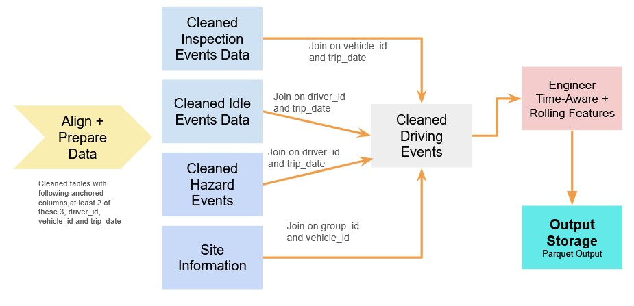

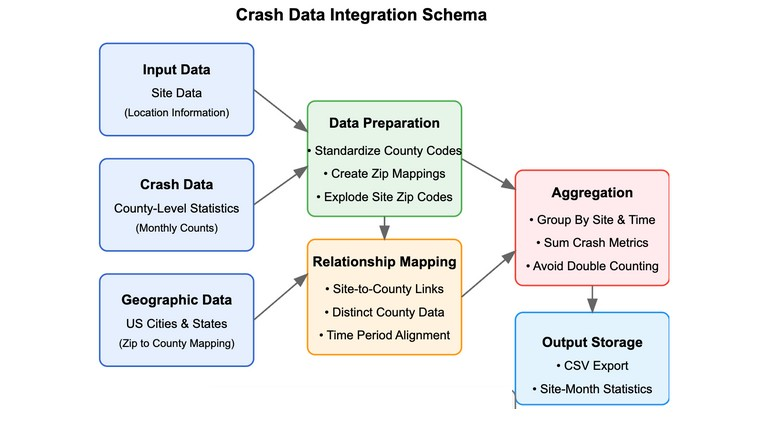

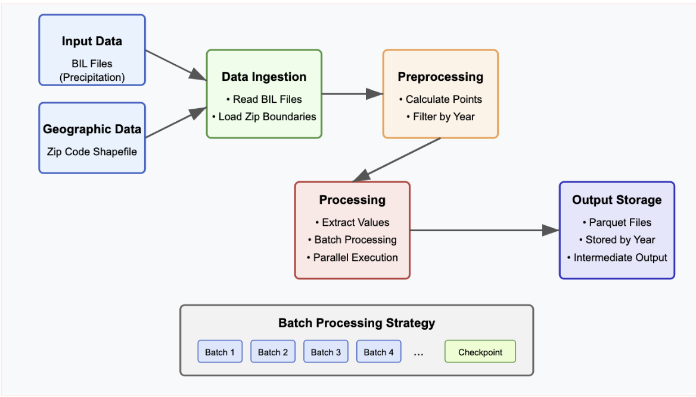

<em>We process and engineer features from external and internal data sources separately. External data includes crash statistics, precipitation, and geographic mappings, while internal data includes Motive driver activity and inspection logs. These are then joined by location (ZIP/county) and time (date/month) to create a unified, feature-rich dataset used for modeling.</em>

To build a comprehensive dataset for accident prediction, we processed and joined both internal FusionSites data and external datasets, such as crash statistics and weather information. Our approach focused on cleaning, standardizing, and aligning records across systems to ensure consistent geographic and temporal matching.

-   Internal data cleaning (FusionSites): We cleaned and prepared four main tables related to driver behavior: hazard events, driving periods, inspections, and idle events. This involved removing nulls, filtering outliers, renaming columns, and extracting trip-level date information. These datasets were then joined by `driver_id`, `vehicle_id`, `trip_date`, and `main_event_type` to create a master dataset that captures all activity for each trip.

-   External data integration: We incorporated accident records, insurance claims, and environmental data into the trip dataset. For accident records, we matched location fields like ZIP code, city, and state using fuzzy matching and manual corrections. Precipitation data was extracted from spatial raster files and mapped to ZIP codes. Both types of data were joined to trip records using date and location keys.

-   Geographic and temporal alignment: We standardized ZIP codes, state and county identifiers, and handled location ambiguities using regional FusionSites data. For each accident, we added county-level crash statistics and average precipitation data. Where direct matches were unavailable, we implemented fallback strategies using nearby ZIP codes or adjacent time windows.

-   Data aggregation and feature readiness: We grouped data at the monthly county level and computed key metrics such as crash counts, fatalities, injuries, and vehicles involved. Precipitation data was reshaped and categorized to support feature engineering. Special care was taken to avoid data leakage by ensuring only historical data is used in modeling.

### 2. Features Engineering

Feature engineering is conducted separately on internal and external datasets to ensure that all variables are clean, structured, and informative before joining them into a unified dataset. The result is a single, feature-rich dataset that links driving behavior, environmental factors, and crash outcomes at a daily and county level. This dataset is cached for efficient exploration and modeling in downstream notebooks.

#### External data feature engineering

**State crash data (`yearly_crash_data_processing.ipynb`)**
- No missing or non-numerical variables were used.
- Raw crash-level data was grouped by crash year, month, state, and county.
- Aggregated features include:
- Total number of crashes
- Total fatalities
- Total injuries
- Total vehicles involved
- Output: `state_crash_monthly_county_counts`

**Precipitation data**
- Used daily total precipitation by ZIP code from 2023 to 2025.
- Transformed from wide to long format.
- Aggregated at the site-date level to compute:
- Mean, median, std dev, quartiles, min, max, and IQR.
- Output: `final_precipitation_stats`

**ZIP code shapefile and FusionSites data (`site_radius_by_zipcode.ipynb`)**
- Transformed geographic coordinates to appropriate CRS for distance calculations.
- Calculated distances between each FusionSites ZIP code and surrounding ZIP codes (within a 40-mile radius).
- Derived features:
- Target ZIP codes per site
- Distance to each ZIP
- Output: Intermediate site-ZIP distance tables

**Crash + Precipitation mapping to sites (`map_external_data_to_sites.ipynb`)**
- Mapped aggregated crash and weather data to site locations via ZIP and county codes.
- Applied inner joins with distinct filters to avoid duplication.
- Output:
- `aggregated_site_radius_crash_df`
- `final_precipitation_stats`

**Location data feature engineering (`location_data_feature_engineering.ipynb`)**
- Aggregated crash stats by site, brand, year, and month.
- Created rolling-window statistics (mean, median, std, IQR, etc.) using Spark window functions.
- Calculated moving averages for crash metrics (1–6 months) and precipitation metrics (1–3 days).
- Generated a complete calendar with all site-date combinations to ensure temporal coverage.
- Output: Final engineered CSV file ready to be merged with Motive data.

#### Internal data feature engineering (Motive + driver-level data)

The following tables are cleaned, transformed, and joined by `driver_id`, `vehicle_id`, and `trip_date`:

**Drivers Trips Information** - Includes trip frequency, average speed, distance, recency, and rolling trip stats: - `trip_date_distance`, `trip_date_minutes`, `trip_date_avg_speed_mph` - Rolling features like `rolling_7trip_avg_speed_mph`, `rolling_30day_total_distance` - Trip behavior change metrics: `change_in_distance`, `change_in_minutes`

**Hazard Event Information for each trip** - Event-based features for each trip: - Total and type-specific event counts (e.g., `speeding`, `drowsiness`, `crash`, roughly 15+ different hazard events from Motive) - Rolling 7/15/30-day sums per event type - Speeding severity breakdowns (`low`, `mid`, `high`) and their respective rolling stats - Ratios per distance, minutes, and events to normalize behavior - Coaching and review metrics (e.g., `prev_review_rate_per_km`)

**Vehicle Inspection per each trip date** - Inspection-based features for each vehicle-trip: - Cumulative inspection counts and issue rates - Days since last inspection - Rolling inspection/activity ratios across previous 7/15/30 trips

**Driver Idling Events**

- Idle behavior for each trip: `idle_event_count_per_trip`, `avg_idle_duration_per_trip`, `total_idle_minutes_per_trip` - Rolling 7, 15, 30 -trip averages for idle count, duration, and minutes

**Trips and corresponding sites**: This is used to understand where would this trip dispatched from, allowing to mapped with weather data within that region - Geographic link between trips and site location: - `zipcode`, `motive_group_id` for mapping driver behavior to site-level risk

These table are going to be joined together with following shared keys `driver_id`, `vehicle_id`, `trip_date`, and `group_id`.

### 3. Final aggregation & train-test split

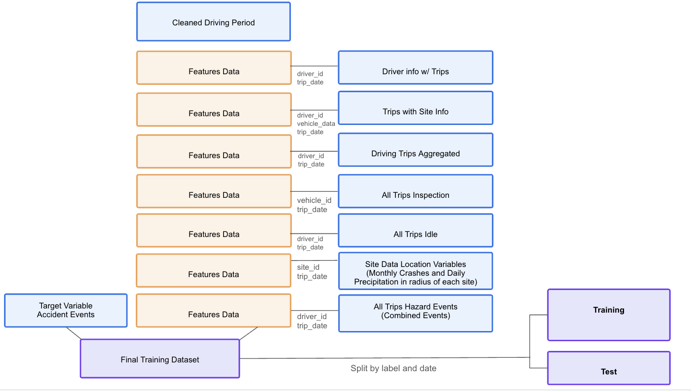

The final modeling dataset is created by merging internal and external engineered features using shared keys such as `driver_id` and `trip_date`. The unified feature table contains:

-   Behavior metrics at the trip level
-   Rolling trends across time and trip history
-   Inspection and idle summaries
-   Demographic and tenure data
-   Location-aware features (ZIP/site linkage)
-   External crash and precipitation statistics at the site-date level

This final dataset is saved in Parquet format to enable efficient reuse for modeling and evaluation workflows.

#### Data preparation for modeling

Before splitting the data, we perform the following steps: - Remove leakage-prone columns: Any features that leak future information (e.g., cumulative trip counts as of the current trip) are excluded. 

  - Handle categorical and date variables: Non-numerical fields such as `trip_date` are either removed or converted using one-hot encoding. 
  - Remove unnecessary columns: Columns that are not relevant to the modeling process (e.g., `vehicle_id`, `driver_id`, `trip_id`) and could lead to data leakage and overfitting are removed.
  - Address class imbalance: The dataset contains a significant imbalance (~368 accident trips vs. 201,498 non-accident trips). To reduce bias while preserving structure, we apply undersampling by removing all non-accident trips that occurred before the first recorded accident trip. This helps maintain data integrity while improving class balance.

#### Train-test split

We split the data based on a fixed temporal threshold: 

- Training set: All trips before `2024-11-01`
- Test set: All trips on and after `2024-11-01`

The split above will ensure a rough 80-20 split between train and test sets.

### 4. Model Training

We trained two classifiers: **Random Forest (RF)** and **Gradient Boosted Trees (GBT)**, each with their own tuning and evaluation pipelines.

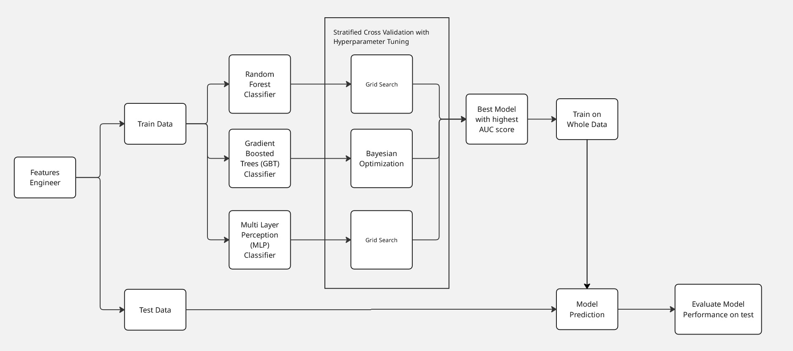

#### Random Forest Classifier

-   We perform 4-fold stratified cross-validation for hyperparameter tuning to address class imbalance.
-   Tuned parameters included:
    -   `numTrees`: [50, 60, ..., 120]
    -   `maxDepth`: [5, 10, 15]
    -   `maxBins`: [32, 64]
-   After selecting the best configuration (110 trees, depth of 5, 64 bins), we retrained the model on the full training set.
-   Feature importance analysis revealed 26 features with zero impact; these were dropped before final training.
-   The model was retrained after filtering and evaluated on a holdout set for unbiased performance assessment.

#### Gradient Boosted Trees Classifier

-   Hyperparameter tuning was performed using **Optuna** with a Tree-structured Parzen Estimator (TPE).
-   Initial tuning explored:
    -   `max_depth`: [3, 15]
    -   `step_size`: [0.05, 3]
    -   `subsample_rate`: [0.5, 1.0]
    -   `min_instances_per_node`: [1, 20]

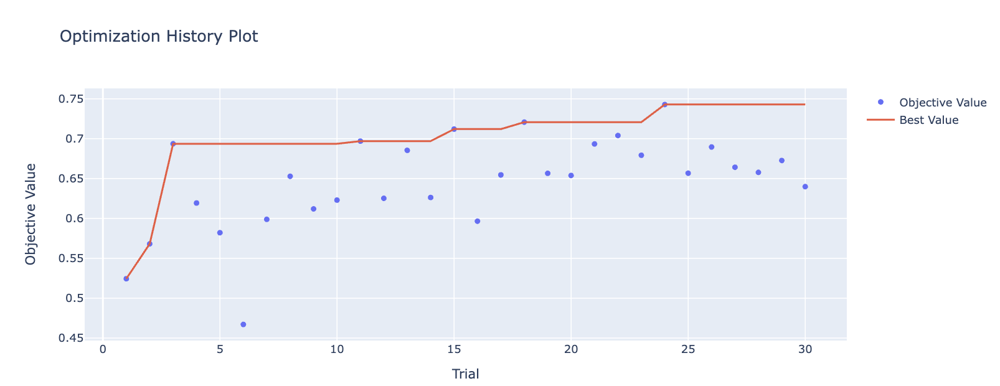

-  The inital 30 trials with all of the featues took 2 hr and 45 min to complete. The best AUC on the validation set was .7429 with a max_depth of 3, step_size of 0.228 subsample_rate of 0.884 and min_instances_per_node of 10. 
-  We then took the best performing parameters and ran cross validation on the training set to get a better estimate of the model performance and make sure the best parameters were not overfitting to the validation set. This took 42 minutes. 
- After selecting the top 5 models via stratified validation, we performed feature importance filtering, dropping 86 non-informative features.
-   A second Optuna round refined `step_size`, `subsample_rate`, and `min_instances_per_node` within the ranges where best perfomance was observed previously, with `max_depth` fixed at 3. This sound used cross validation instead of a fixed validation set. 
- The 10 additional trials took 1hr and 29 min to run. The best AUC value was 0.674 with a step_size of 0.227, subsample_rate of 0.884 and min_instances_per_node of 10.
-  Final model was trained using optimal hyperparameters on the full training data. This took 3 minutes. 
- Making predictions on the test set took less than a second and evaluation with the PySpark evaluators took 45 seconds. 

### Multilayer Perceptron Classifier

- Hyperparameter tuning was performed using the same train/val split as above with a Grid Search 
-   Tuned parameters included:
    -   `layers`: [num_features, 10, 2], [num_features, 16, 8, 2]
    -   `stepSize`: [0.001, 0.01, 0.1]
- The initial hyperparameter tuning across these six parameter configurations took 3h 18 min. All of the cross validation AUC scores round to 0.50. We could not use a weight column and using a weighted loss function would have required a custom loss function, so the model was not able to learn anything useful.
- Training the final model with the best set of hyperparameters took 1 minute. 

### 5. Model Performance on Train Data
These are the results of our models given the whole train data 
#### Random Forest 
-   **AUC**: 0.8685 
-   **AUPRC**: 0.0211 (very low)
-   **Precision** (overall): 0.9977
-   **Recall** (overall): 0.8972
-   **True Positive Rate (accidents only)**: 59.61%
-   **False Positive Rate**: 10.22%
-   **Positive Predictive Value (accidents only)**: 0.9%

**Observations:**
- Low Area under the PR curve: this suggests the model perform poorly at distinguishing the positive class even though we already include a class weight in our Random Forest Classifier. This result mean that our current training approach to class imbalanced wasn't fully address the class imbalanced issues (in this case, the model still has difficult time learning about the positive case)
- There is a sharp drop in precision at low recall. Precision rapidly declines after a small amount of recall is achieved. This means that most of the true positives are detected only when allowing a large number of false positives.

#### GBT Classifier 
-   **AUC**: 0.91629
-   **AUPRC**: 0.01697 (very low)
-   **Precision** (overall): 0.99819
-   **Recall** (overall): 0.8150
-   **True Positive Rate (accidents only)**:  0.8615
-   **False Positive Rate**: 18.51%
-   **Positive Predictive Value (accidents only)**: .00072

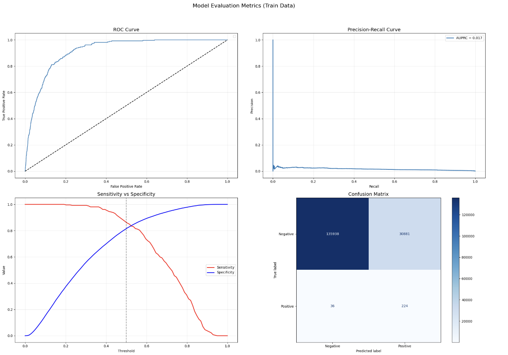

#### MLP Classifier 

**Without Early Stopping**
-   **AUC**: 0.9097
-   **AUPRC**: 0.1919
-   **Precision** 0.9988
-   **Recall** 0.99880
-   **True Positive Rate (accidents only)**: 0.2346
-   **False Positive Rate**: 0.0000
-   **Positive Predictive Value (accidents only)**: 1.0000

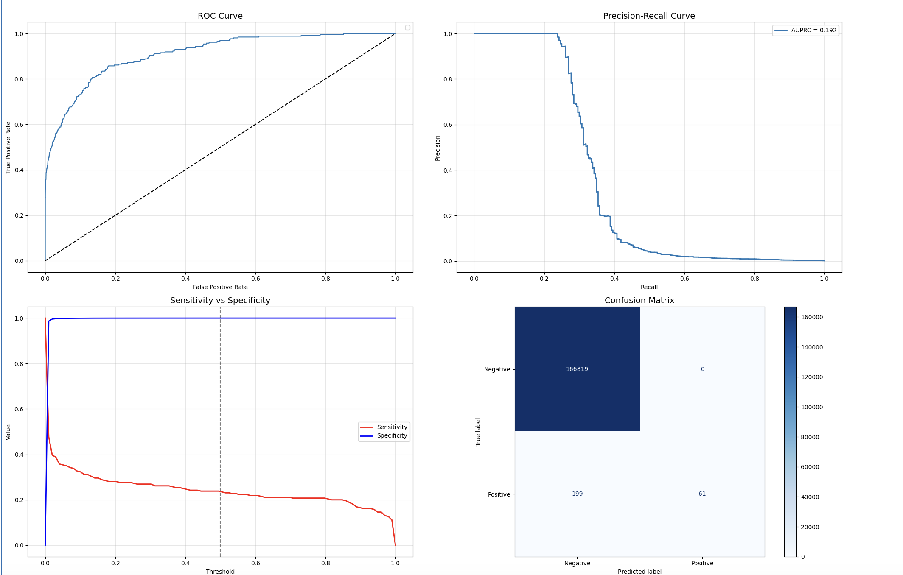

**With Early Stopping**
-   **AUC**: [FILL IN]
-   **AUPRC**: [FILL IN]
-   **Precision** [FILL IN]
-   **Recall** [FILL IN]
-   **True Positive Rate (accidents only)**: [FILL IN]
-   **False Positive Rate**: [FILL IN]
-   **Positive Predictive Value (accidents only)**: [FILL IN]

### 6. Model Performance on Test Data

#### Random Forest

-   **AUC**: 0.5698 (barely above random)
-   **AUPRC**: 0.00298 (very low)
-   **Precision** (overall): 0.9953
-   **Recall** (overall): 0.8708
-   **True Positive Rate (accidents only)**: 17.59%
-   **False Positive Rate**: 12.75%
-   **Positive Predictive Value (accidents only)**: 0.32%

**Observation:**
- The PR curve is nearly flat at the bottom, and the area under the curve is close to zero. This confirms that the model is not effective at identifying the positive class — precision remains very low across all recall levels
- Out of 108 actual positive cases, the model correctly predicted only 19, while 89 were missed (false negatives). The recall (sensitivity) is extremely low, suggesting the model fails to detect most positive instances. At the same time, 5,759 false positives indicate that increasing sensitivity would likely worsen precision even further.

> Despite strong overall precision and recall (due to class imbalance), the model struggles to identify true accidents. Only 0.32% of flagged accidents are correct.

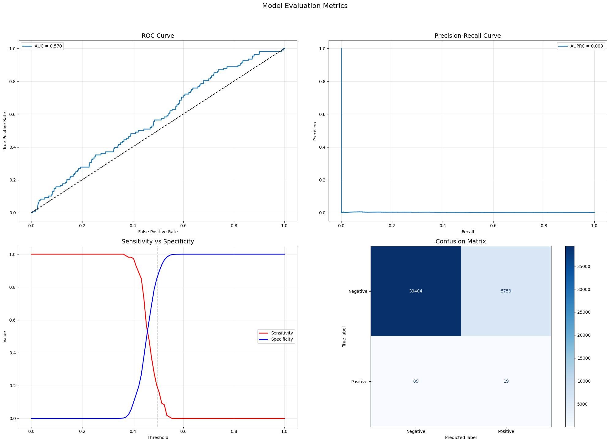

#### Gradient Boosted Trees

-   **AUC**:  0.571
-   **AUPRC**: 0.00293
-   **Precision** (overall): 0.9953
-   **Recall** (overall): 0.7623
-   **True Positive Rate (accidents only)**: 0.2778
-   **F1 Score**: 0.8629
-   **False Positive Rate**:  23.65%
-   **True positive rate (accidents only)**: 0.0030

> The GBT model achieves a decently high F1 but suffers from an extremely low positive predictive value. Only 0.30% of predicted accidents are correct, indicating many false alarms. Compared to the performance on the training set, we observe a very large decrease in model performance, indicating that there was overfitting during training which lead to overly optimistic performance estimates. 

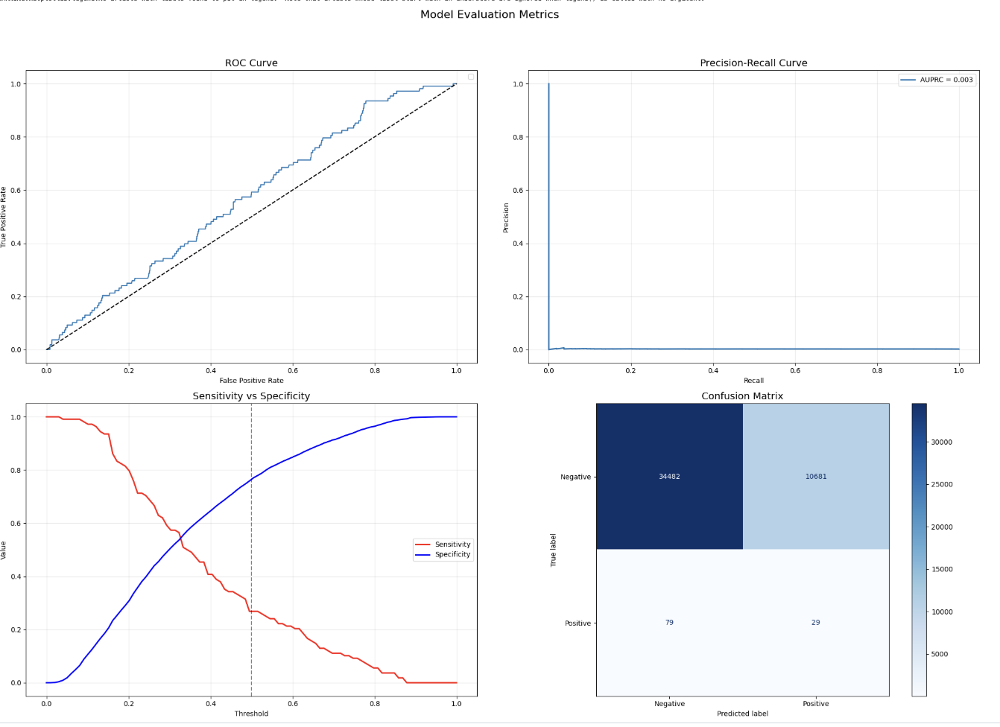

#### Multi Layer Perception Classifier

**Without Early Stopping**
-   **AUC**: 0.90972
-   **AUPRC**: 0.002427
-   **Precision** 0.9988
-   **Recall** 0.99748
-   **True Positive Rate (accidents only)**: 0.0000
-   **False Positive Rate**:  0.0001
-   **Positive Predictive Value (accidents only)**: 0.0000

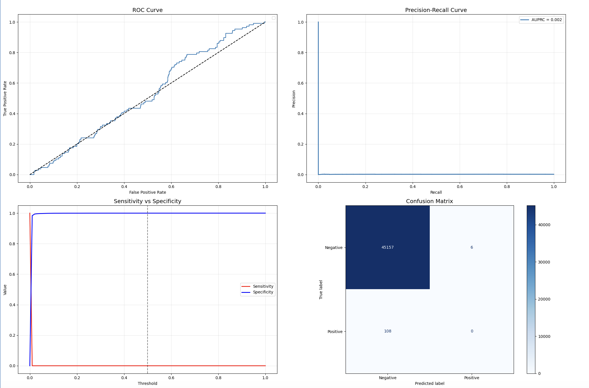

**With Early Stopping**
-   **AUC**: [FILL IN]
-   **AUPRC**: [FILL IN]
-   **Precision** [FILL IN]
-   **Recall** [FILL IN]
-   **True Positive Rate (accidents only)**: [FILL IN]
-   **False Positive Rate**: [FILL IN]
-   **Positive Predictive Value (accidents only)**: [FILL IN]

### 6. Key takeaways

-   Both models surfaced meaningful features, including prior accidents, safety events, inspection history, and driving tenure.
-  External data (precipitation, crash statistics) was less informative than internal data. 
-   GBT slightly outperformed RF in terms of AUC but still lacked precision on accident prediction due to data imbalance.
-   The quality of the prediction is ultimately limited by data quality: missing values, inconsistent adoption of Motive, and unreliable accident records.
-   Future modeling should focus on improving data coverage, especially around route information, accident validation, and consistent sensor usage.
-   Several key features were consistently important across both the Random Forest and Gradient Boosted Tree models:
    -   `vehicle_cum_issues`: History of vehicle issues is a strong predictor of accident risk.
    -   `rolling_15trip_avg_speed_mph`: Consistent high speeds over recent trips are associated with higher risk.
    -   `rolling_15day_total_distance`: Recent driving intensity plays a significant role in crash likelihood.
    -   `prev_trip_date_distance`: Distance from the previous trip may indicate driver fatigue or exposure. _ Additional insights from feature importance analysis
    -   Long-term driving patterns are more predictive than single-trip behavior.
    -   GBT emphasized distraction-related events (e.g., cell phone use, drowsiness), while RF relied more on historical ratios and accident history.
    -   Speed-related features were important when considered over time, rather than as isolated events.
    -   Vehicle condition and maintenance history should be monitored closely for risk management.

* A more practical short-term solution could be deploying a **dashboard** highlighting high-risk behaviors (e.g., speeding, harsh braking, overdue inspections) rather than deploying a low-confidence predictive model.

## VI. Challenges and Project Limitations:

Despite our efforts to engineer meaningful features and train predictive models, several challenges and limitations affected the scope and reliability of the project:

-   **Incomplete and inconsistent insurance claims data**
    Some insurance records were missing driver names or did not match any names from the Motive platform. In addition, the claims data often lacked vehicle information, which is critical since drivers may operate multiple vehicles in a single day. These gaps made it difficult to accurately link insurance-reported accidents with internal trip records.

-   **Driver login gaps and potential misattribution**
    Before starting their trips, drivers sometimes failed to log into the Motive system. While the system still captured the trip data, the lack of a logged-in user meant that the associated `driver_id` was either missing or incorrect. This issue, combined with inconsistent or unreliable accident dates in the insurance claims data, made accurate matching difficult. To address this, we applied a fallback approach: when a valid `driver_id` was available, we matched each insurance-reported accident to the closest trip (by date) within a 30-day window starting from the reported accident date in the Motive records.

-   **Missing demographic information for some drivers**
    Due to the login inconsistencies, many driver IDs lacked basic demographic information such as age or employment start date. As a result, we excluded these fields from our feature set and used each driver’s first recorded trip date as a proxy for driving tenure.

-   **Limited inspection data quality**
    While inspections are required at the start of a shift, it's unclear whether drivers genuinely completed them or simply rushed through. The inspection data only include the inspection date but not timestamp data or duration or completion detail. This made it impossible to assess inspection thoroughness or detect potentially falsified entries.

-   **Lack of trip-level location granularity**
    We did not have access to start and end coordinates for individual trips. This limited our ability to match each trip precisely to weather conditions. Since weather can vary significantly even within the same city, we worked around this limitation by aggregating precipitation data within a 40-mile radius of the driver’s service site.

## Project Timeline

* Project planning and data dictionary (3/10 -  3/17)
* EDA and Baseline pipeline (3/18 - 3/31)
* Feature Engineering and hyperparameter tuning (4/1 - 4/7)
* Final model selection and final report (4/8 - 4/14)

See `milestones` for detailed progress reports. 

## How to Contribute 

We welcome contributions to this project! If you have suggestions, improvements, or bug fixes, please follow these steps:

1. Fork the repository.
2. Create a new branch for your feature or bug fix.
3. Make your changes and commit them with clear messages.

High priority areas for contributions include:

- Automating the data processing and training pipeline using [Databricks SDK for Python](https://docs.databricks.com/aws/en/dev-tools/sdk-python)
- Implementing a dashboard to visualize driver behavior and accident risk (data is not publicly available, so this would be a mockup)

## Contact

For any questions or feedback, please reach out to Isabel Arvelo (isabel.c.arvelo@vanderbilt.edu) or Trang Hoang (trang.t.hoang.1@Vanderbilt.Edu). 
